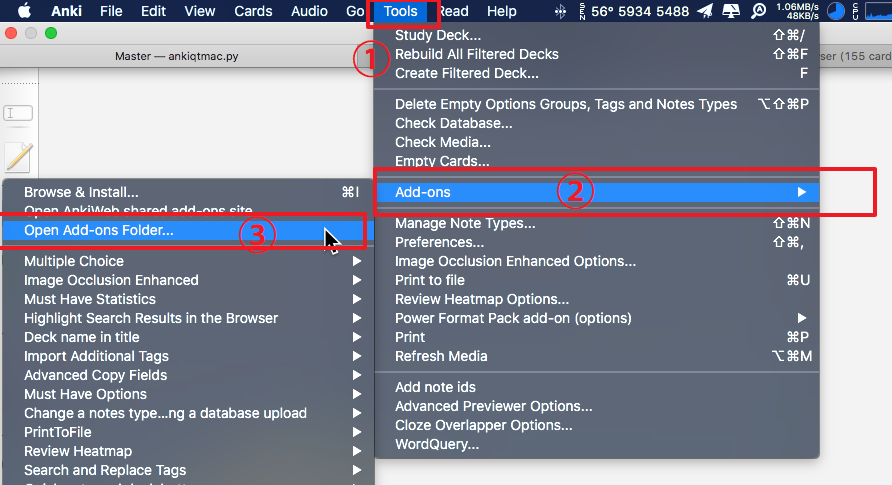
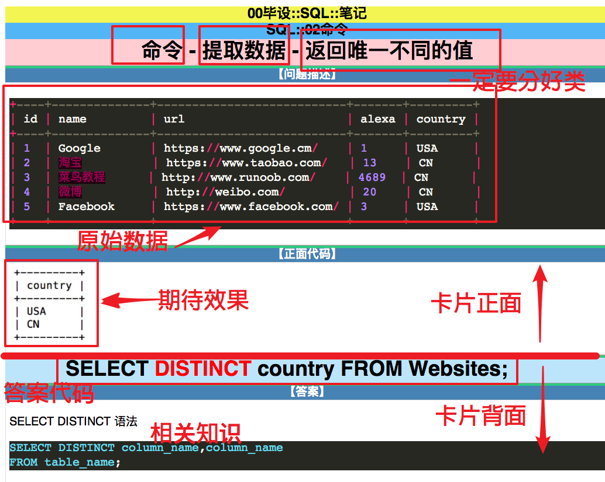
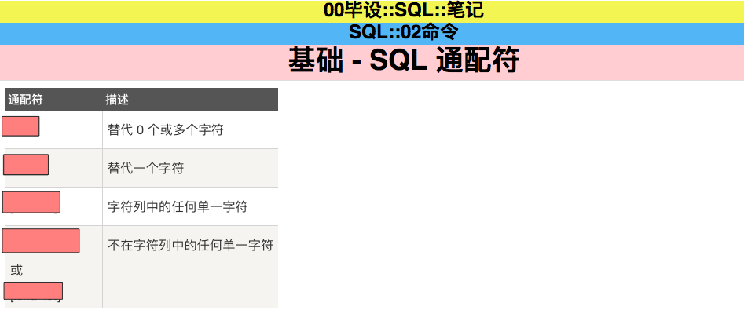

# Anki

## 准备

将 add-ons 文件解压,覆盖 anki 原始的插件文件夹

### 如何查看 anki add-ons 文件夹?

## 制卡规范

### 上手

每个人先用 SQL.akpg 刷卡感受下 demo 的样式, 这个是我总结出来的比较好的制卡习惯.

### 名词解释

### 遮板法(需要插件 Image Occlusion Enhanced(在 add-ons 文件夹中有了)))

### 技巧型知识点

## 提交

每人自己新建一个自己的分支, 在自己的分支上提交控制历史. 最终版本完成后再 merge 至 master 分支

## 资源

1.  trello(任务管理用)[https://trello.com]
2.  anki 中文文档[http://www.ankichina.net/Index/ankishouce]
3.  anki 知乎专栏[https://zhuanlan.zhihu.com/-anki]
4.  anki 插件目录[https://ankiweb.net/shared/addons/]

## 项目相关

1.  trello 小组[https://trello.com/invite/b/so3naYKp/02a35ac822b8512675fb24b3bcf9bc91/%E7%BC%96%E7%A8%8B%E5%8D%A1%E7%89%87]
2.  项目地址[https://github.com/kashimotoxiang/Anki]
